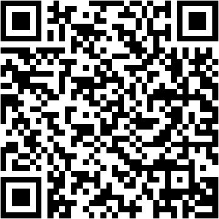

# Proxy Config

Two client-facing files live at the repo root:

- `clash-override.yaml`: Clash Verge rule enhancement.
- `clash-remote-merge.yaml` + `clash-remote-override.yaml`: auto-updating
  Clash Verge enhancements backed by remote rule providers.
- `shadowrocket.conf`: generated Shadowrocket config.

Shadowrocket uses your custom rules first, then a domestic/foreign split with
ad blocking from Johnshall's `sr_cnip_ad.conf`.

## Routing Notes

- In Clash, broker/account domains use the subscription's `🇺🇸 美国自动`
  `url-test` group so the fastest measured US node is selected automatically.
- In Shadowrocket, broker/account domains use its separate `US` `url-test`
  group. Shadowrocket node definitions are never copied into Clash.
- Broker coverage includes Interactive Brokers, thinkorswim/Schwab, Robinhood,
  Fidelity, E*TRADE, Webull, tastytrade, TradeStation, and Alpaca. Rules use
  domain suffixes for broker-owned web, login, and API subdomains.
- In Clash only, OpenAI/ChatGPT uses `🇺🇸 美国手动`; other Clash-only AI routes
  use `🇯🇵 日本手动`. Gemini follows the shared `US` policy and maps to
  `🇺🇸 美国自动` in Clash.
- Logitech Options+ domains use `DIRECT`; Clash also has process-name fallbacks
  for the Options+ app, agent, updater, and Electron helpers.
- Hugging Face China mirror (`hf-mirror.com`) uses `DIRECT`.

## Clash Verge Rev

### Policy mapping

Shadowrocket and Clash keep separate nodes and policy groups. The shared custom
rules map only the routing intent:

| Shadowrocket policy | Current Clash policy |
| --- | --- |
| `US` | `🇺🇸 美国自动` |
| `JP` | `🇯🇵 日本手动` |
| `DIRECT` | `DIRECT` |

`🇺🇸 美国自动` performs latency-based selection among the subscription's US
nodes. `🇺🇸 美国手动` remains a separate Clash-only stable selection used for
OpenAI and Apple media routes. No Shadowrocket node definitions are copied into
Clash.

### Auto-updating rules

`scripts/build_clash_rule_providers.py` converts the shared Shadowrocket custom
rule source into policy-specific Mihomo `classical` providers under
`clash/rules/`. The GitHub workflow regenerates them with `shadowrocket.conf`.

After the generated files are published to `main`, bind both enhancements to
the active Clash subscription:

1. Merge: `clash-remote-merge.yaml`
2. Rules: `clash-remote-override.yaml`

Mihomo then refreshes each provider from the repository's raw GitHub URL every
hour. The Merge defines provider URLs; the Rules file maps each provider to the
appropriate Clash policy group. Clash-only rules stay inline in the Rules file.

### Static rules fallback

`clash-override.yaml` is a per-subscription Rules enhancement; Clash Verge does
not read the repository file automatically.

To apply it:

1. Open **Profiles** in Clash Verge Rev.
2. Right-click the active subscription and choose **Edit Rules**.
3. Open the advanced YAML editor and replace its contents with
   `clash-override.yaml`.
4. Save, then reload/apply the subscription.
5. In **Proxies**, confirm that `🇺🇸 美国自动` is a `URL Test` group and
   run its latency test once.

Rules are matched from top to bottom, so these entries must stay in `prepend`.
The policy-group names must also match the active subscription exactly.
After applying a routing change, reconnect or restart thinkorswim so its
existing long-lived connections are recreated through the newly selected node.
If a stable account IP matters more than latency, point the broker rules back to
`🇺🇸 美国手动`; `url-test` may use a different US exit for new connections.

## Shadowrocket

After this repo is pushed to GitHub, the workflow generates:

```text
assets/shadowrocket-qr.png
```

Scan that QR code in Shadowrocket to add the config directly.



If you want to generate the QR manually:

```bash
python3 scripts/update_qr.py --url "https://raw.githubusercontent.com/OWNER/REPO/refs/heads/main/shadowrocket.conf"
```

To rebuild manually:

```bash
python3 scripts/build_shadowrocket.py
```

To edit your personal Shadowrocket overrides, change:

```text
source/shadowrocket-custom-rules.list
```

The GitHub Action runs weekly and commits when `shadowrocket.conf`, its QR code,
or the generated Clash rule providers change.
