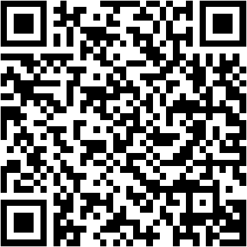

# Proxy Config

Two client-facing files live at the repo root:

- `clash-remote-merge.yaml` + `clash-remote-override.yaml`: auto-updating
  Clash Verge enhancements backed by remote rule providers.
- `shadowrocket.conf`: generated Shadowrocket config.

Shadowrocket uses your custom rules first, then a domestic/foreign split with
ad blocking from Johnshall's `sr_cnip_ad.conf`.

## Routing Notes

- In Clash, broker/account domains (except Fidelity) use the subscription's `🇺🇸 美国自动`
  `url-test` group so the fastest measured US node is selected automatically.
- In Shadowrocket, broker/account domains (except Fidelity) use its separate `US` `url-test`
  group. Shadowrocket node definitions are never copied into Clash.
- Broker coverage includes Interactive Brokers, thinkorswim/Schwab, Robinhood,
  E*TRADE, Webull, tastytrade, TradeStation, and Alpaca. Rules use
  domain suffixes for broker-owned web, login, and API subdomains.
  Fidelity (`fidelity.com`) uses `DIRECT` in both clients.
- Claude/Anthropic, other AI tools (Grok/xAI, Perplexity, Poe, Copilot,
  Cursor, Codeium/Windsurf, Midjourney) and X (Twitter) use the shared `JP`
  policy, which maps to `JP-Auto` (Japan nodes) in Clash. In Clash only, OpenAI/ChatGPT
  uses `🇺🇸 美国自动`. Gemini follows the shared `US` policy.
- Clash routes only to automatic (`url-test`) region groups, never the manual
  ones.
- Logitech Options+ domains use `DIRECT`; Clash also has process-name fallbacks
  for the Options+ app, agent, updater, and Electron helpers.
- Hugging Face China mirror (`hf-mirror.com`) uses `DIRECT`.

## Clash Verge Rev

### Policy mapping

Shadowrocket and Clash keep separate nodes and policy groups. The shared custom
rules map only the routing intent:

| Shadowrocket policy | Current Clash policy |
| --- | --- |
| `US` | `🇺🇸 美国自动` |
| `JP` | `JP-Auto` (static fallback: `🇯🇵 日本自动`) |
| `DIRECT` | `DIRECT` |

`US-Auto` and `JP-Auto` perform latency-based selection among the
subscription's US and Japan nodes, excluding 特殊/限速 and ≥5x nodes. No Shadowrocket node
definitions are copied into Clash.

### Auto-updating rules

`scripts/build_clash_rule_providers.py` merges the shared Shadowrocket custom
rule source (`source/shadowrocket-custom-rules.list`) with the Clash-only source
(`source/clash-extra-rules.list`) into one policy-specific Mihomo `classical`
provider per policy (US / JP / DIRECT) under `clash/rules/`. The GitHub workflow
regenerates them with `shadowrocket.conf`. The NAS mihomo reads the same
providers (see `CLAUDE.md`).

After the generated files are published to `main`, bind both enhancements to
the active Clash subscription:

1. Merge: `clash-remote-merge.yaml`
2. Rules: `clash-remote-override.yaml`
3. Groups: `clash-remote-groups.yaml`

Mihomo then refreshes each provider from the repository's raw GitHub URL every day. The Merge defines provider URLs; the Rules file maps each provider
to the appropriate Clash policy group. No rules are inline; add Clash-only
rules to `source/clash-extra-rules.list`.

## Shadowrocket

After this repo is pushed to GitHub, the workflow generates:

```text
assets/shadowrocket-qr.png
```

Scan that QR code in Shadowrocket to add the config directly.



If you want to generate the QR manually:

```bash
python3 scripts/update_qr.py --url "https://raw.githubusercontent.com/OWNER/REPO/refs/heads/main/shadowrocket.conf"
```

To rebuild manually:

```bash
python3 scripts/build_shadowrocket.py
```

To edit your personal Shadowrocket overrides, change:

```text
source/shadowrocket-custom-rules.list
```

The GitHub Action runs weekly, and also runs when the shared custom-rule source,
the Clash-only source, or the provider generator is pushed to `main`. It commits when
`shadowrocket.conf`, its QR code, or the generated Clash rule providers change.

## Clash region groups

`clash-remote-groups.yaml` (bound in Clash Verge as the subscription's **Groups** enhancement, next to Merge and Rules) defines its own `JP-Auto` and `US-Auto` `url-test` groups from node names (regex on 日本/Japan/JP and 美国/美國/USA, with an `exclude-filter` for 特殊/限速/≥5x nodes), and `clash-remote-override.yaml` routes to them. Rules therefore do not depend on the subscription's group names or their flag emoji.
